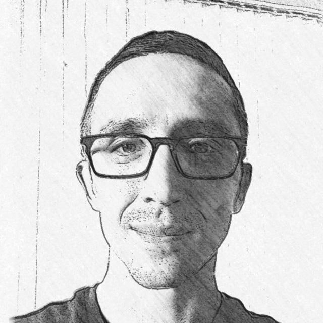

# Технический писатель Корягин Владимир Александрович

*Копирайтер, рерайтер, руководитель команды переводчиков, устный и письменный переводчик, редактор, корректор (английский – русский, русский – английский)*

- [Ключевые навыки](#ключевые-навыки)
- [Образование](#образование)
- [Профессиональный опыт](#профессиональный-опыт)

<table width="80%" border="0" cellpadding="4">
<tr align="left" valign="middle">
    <td>Электронная почта</td>
    <td>vladimir.koryagin7@gmail.com</td>
</tr>
<tr align="left" valign="middle">
    <td>Телефон</td>
    <td>+7-988-525-5291</td>
</tr>
<tr align="left" valign="middle">
    <td>Дата рождения</td>
    <td>12.05.1982</td>
</tr>
<tr align="left" valign="middle">
    <td>Город проживания</td>
    <td>Краснодар</td>
</tr>
<tr align="left" valign="middle">
    <td>Гражданство</td>
    <td>Россия</td>
</tr>
</table>

---

## Ключевые навыки

* умею грамотно писать на русском и английском языках с учетом конкретных требований к стилю изложения (включая инфостиль), целевой аудитории и специфики контекста;
* знаю, как применять подход Docs as Code: единый источник информации в репозитории + языки разметки + генераторы статических сайтов;
* имею опыт работы в Confluence;
* умею работать с Linux и Linux Server, Docker, git, GitHub и GitHub Actions, системами виртуализации;
* в целом технически подкован и имею обширное представление о современных системах автоматизированного перевода и вспомогательных инструментах для переводчиков, редакторов, корректоров и других специалистов, связанных с лингвистическими процессами;
* готов к командировкам по России и за рубежом;
* свободно владею устным и письменным английским языком.

---

## Образование

В 2005 г. получил диплом преподавателя по специальности «Филология» на факультете романо-германской филологии (РГФ) *Ивановского государственного университета*.

---

## Профессиональный опыт

**С июля 2012 г. по настоящее время: копирайтер, рерайтер, руководитель команды переводчиков, устный и письменный переводчик, редактор, корректор в бюро переводов «Эксклюзивные лингвистические системы»**

* писал для McKinsey объемные (до 700 стр.) отчетные документы по итогам реализованных проектов в соответствии с ГОСТ 7.32 «Отчет о научно-исследовательской работе» на основе разрозненных источников информации;
* участвую в подготовке текстовых и других материалов на русском и английском языках для McKinsey и других заказчиков;
* координирую проекты и взаимодействую с прямыми заказчиками, включая McKinsey & Company (около 90% рабочего времени), Kearney, Japan Tobacco International, НЛМК, Thales, Heineken, Mars и других;
* веду проекты повышенной сложности для McKinsey, в том числе непосредственно в составе рабочих групп проектов;
* отвечал за внедрение новой облачной системы автоматизированного перевода, цифровых решений по обработке документов, рабочих моделей и других вспомогательных инструментов для упрощения и оптимизации рабочих процессов;
* перевожу документацию и материалы, относящиеся к разным отраслям: банковский бизнес, страхование, ИТ, телекоммуникации, нефтегазовый бизнес и т. д.;
* редактирую и корректирую переводы, выполненные другими переводчиками;
* участвую в разработке глоссариев и других материалов.

**С мая 2011 г. по июль 2012 г.: устный и письменный переводчик английского языка в консалтинговой компании McKinsey & Company**

* переводил документацию и материалы, относящиеся к разным отраслям: банковский бизнес, страхование, ИТ, телекоммуникации, нефтегазовый бизнес и т. д.;
* редактировал и корректировал переводы, выполненные другими переводчиками;
* занимался последовательным и синхронным переводом на конференциях, совещаниях рабочих групп и встречах с клиентами для экспертов, консультантов и партнеров компании и руководства компаний-клиентов, в том числе в зарубежных командировках;
* проводил тренинги на лингвистические темы для консалтинговых рабочих групп и административного персонала компании;
* участвовал в разработке глоссариев и других материалов.

**С апреля 2010 г. по май 2011 г.: переводчик аппарата совета директоров в ОАО «Вимм-Билль-Данн»**

* переводил документацию самой разной функциональной направленности: закупка сырья, маркетинг, инвестиции, бизнес-планирование, бухгалтерский учет, право, бизнес (продажи), кадры, внутренние коммуникации, материалы с заседаний совета директоров;
* занимался последовательным и синхронным переводом на заседаниях совета директоров, совещаниях руководства и встречах разных функциональных подразделений (закупка сырья, бизнес-обзоры, маркетинг, инвестиции, бизнес-планирование и т. д.);
* сопровождал высшее руководство в командировках;
* сопровождал деловых партнеров и инвесторов в экскурсиях по производственным площадкам и другим комплексам компании;
* отношение объемов устного перевода к письменному – примерно 1 к 5, т. е. 20% рабочего времени (в среднем приблизительно 1–2 встречи в день).

**С декабря 2009 г. по апрель 2010 г.: письменный переводчик английского языка в бюро переводов «Янус»**

* переводил статьи в базах знаний для клиентов в секторе ИТ (в том числе для Google);
* работал в большой команде лингвистических специалистов.

**С октября 2006 по декабрь 2009 г.: устный и письменный переводчик английского языка на фрилансе**

* сотрудничал с крупнейшими российскими и зарубежными переводческими компаниями, в том числе с международным бюро переводов Argos Translations, в котором был назван лучшим переводчиком 2007 года;
* переводил тексты технической направленности (ИТ, телекоммуникации, маркетинг и т. д.), разнообразные руководства по эксплуатации;
* переводил устно на совещаниях и переговорах для страховых компаний «Стандарт-резерв» и «Русская страховая компания» в Москве;
* выполнял редакторскую и корректорскую правку работ, выполненных другими переводчиками;
* во время работы фрилансером научился самостоятельно работать в качестве индивидуального предпринимателя, гибко планировать свой рабочий график и загрузку, общаться с представителями и менеджерами переводческих компаний (бюро переводов), договариваться о сроках и оплате работ.

**С февраля 2005 г. по октябрь 2006 г.:  письменный переводчик английского языка в бюро переводов ООО «ДИАМЕКС Инжиниринг»**

* переводил документы на технические, экономические и технологические темы (описания оборудования, руководства по эксплуатации и т. д.); 
* занимался локализацией программного обеспечения;
* составлял глоссарии.

**С мая по сентябрь 2004 г.: супервайзер транспортного отдела в компании Aramark, национальный парк Денали (Аляска, США)**

* работал в международном коллективе;
* руководил командой из пяти человек;
* взаимодействовал с другими отделами туристической инфраструктуры;
* признан лучшим супервайзером месяца.

**С июня по июль 2003 г.: устный переводчик английского языка в благотворительном фонде Children’s HopeChest**

* переводил устно с английского на русский и с русского на английский языки для членов иностранной группы;
* помогал в организации мероприятий.

**С мая по сентябрь 2002 г.: работник транспортного отдела в компании Aramark, национальный парк Денали (Аляска, США)**

* работал в международном коллективе;
* взаимодействовал с другими отделами туристической инфраструктуры;
* признан лучшим работником месяца.